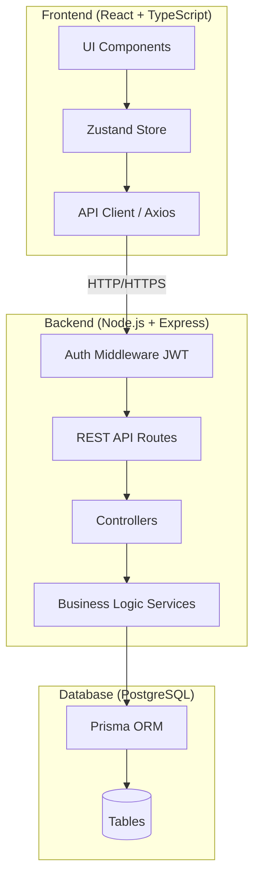
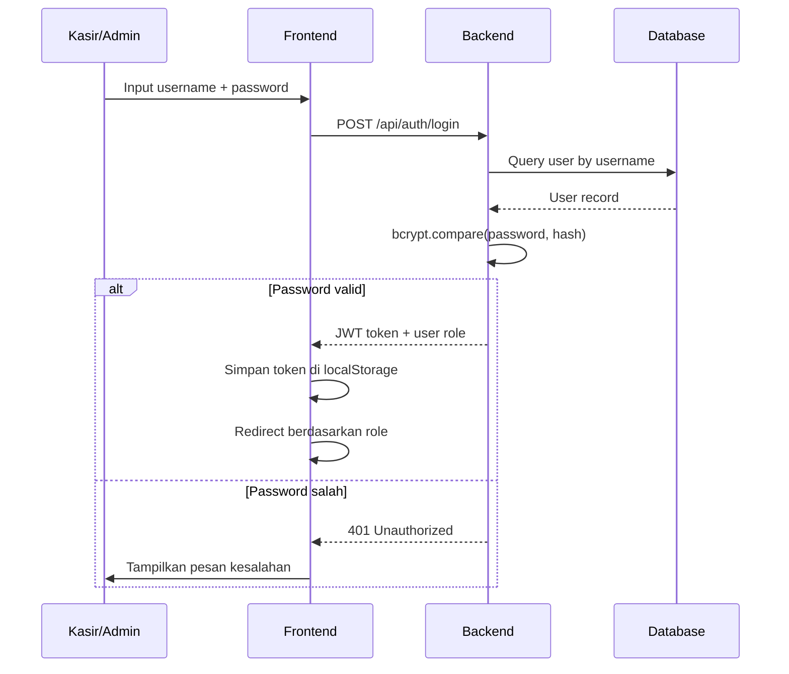
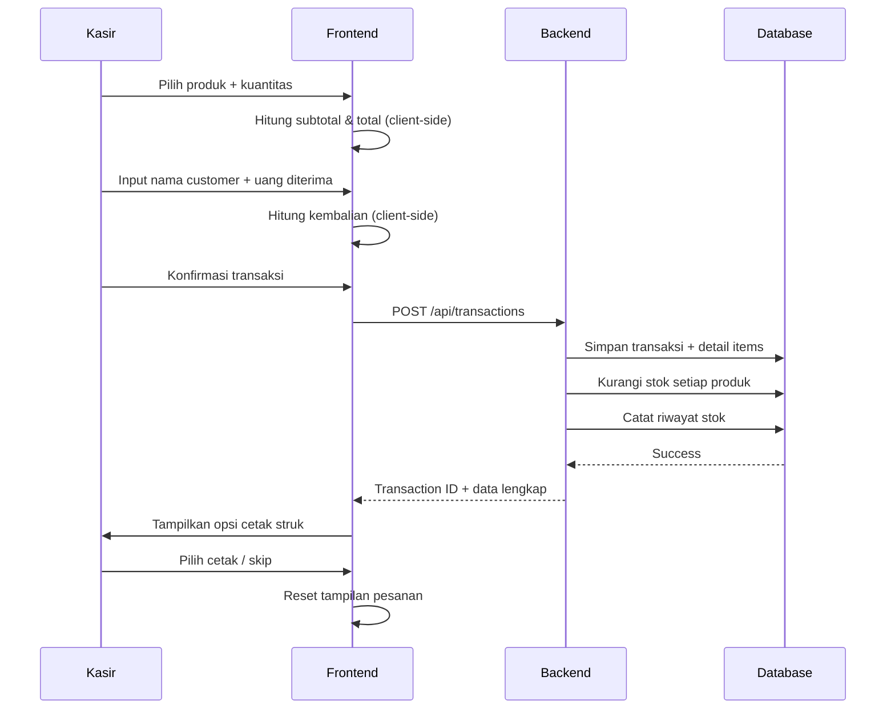
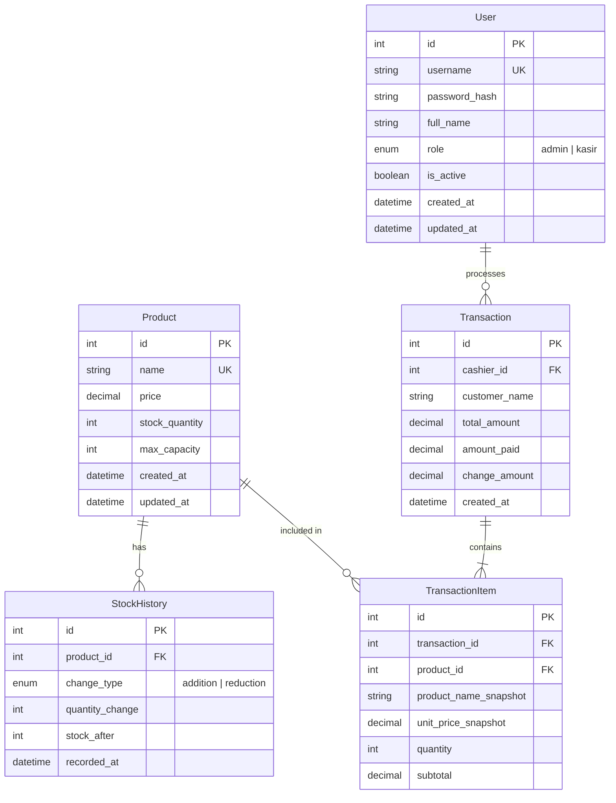

# Design Document: Kasir POS (Sistem Kasir Penjualan)

## Overview

Sistem Kasir Penjualan (SPK) adalah aplikasi web Point of Sale (POS) yang memungkinkan kasir memproses transaksi penjualan, mengelola produk dan stok gudang, memantau performa penjualan melalui dashboard, serta mencetak struk pembelian. Sistem ini mendukung dua peran pengguna: **admin** (hanya mengelola akun kasir) dan **kasir** (akses penuh ke seluruh fitur operasional).

### Tujuan Utama

- Mempercepat proses transaksi kasir dengan kalkulasi otomatis
- Memberikan visibilitas real-time terhadap stok gudang
- Menyediakan dashboard penjualan harian dengan grafik dan ekspor Excel
- Memastikan setiap transaksi tercatat dengan nama kasir dan nama customer
- Mengamankan akses sistem melalui autentikasi berbasis peran (RBAC)

### Tech Stack yang Direkomendasikan

| Layer | Teknologi | Alasan |
|---|---|---|
| Frontend | React + TypeScript | Komponen reaktif untuk update real-time, type safety |
| Styling | Tailwind CSS | Utility-first, cepat untuk UI kasir yang fungsional |
| State Management | Zustand | Ringan, cocok untuk state keranjang pesanan dan dashboard |
| Charting | Recharts | Library chart React-native, mendukung bar/pie chart |
| Excel Export | SheetJS (xlsx) | Library standar untuk generate file .xlsx di browser |
| Backend | Node.js + Express (atau Next.js API Routes) | JavaScript full-stack, ekosistem luas |
| Database | PostgreSQL | Relasional, cocok untuk transaksi dan relasi produk-stok |
| ORM | Prisma | Type-safe, migrasi mudah, cocok dengan TypeScript |
| Autentikasi | JWT (JSON Web Token) + bcrypt | Stateless auth, password hashing aman |
| Print | Browser Print API (window.print) | Native, tidak perlu library tambahan |

---

## Architecture

Sistem menggunakan arsitektur **Client-Server** dengan pemisahan yang jelas antara frontend SPA (Single Page Application) dan backend REST API.



### Alur Autentikasi



### Alur Transaksi Utama



---

## Components and Interfaces

### Struktur Halaman (Pages)

```
/login                  → Halaman login (semua user)
/admin
  /accounts             → Manajemen akun kasir (admin only)
/kasir
  /pos                  → Halaman transaksi POS utama (kasir only)
  /menu                 → Manajemen menu/produk (kasir only)
  /stock                → Manajemen stok gudang (kasir only)
  /dashboard            → Dashboard penjualan (kasir only)
```

### Komponen Utama

#### 1. `AppHeader` (Komponen Global)

Komponen header global yang tampil di semua halaman kasir setelah login. **Tidak tampil** di halaman `/login`.

**Konten Header**

| Posisi | Konten |
|---|---|
| Kiri | Icon toko 🏪 + nama toko (dari config/env, default: "Kasir POS") |
| Kanan | Icon user 👤 + nama lengkap kasir yang sedang login + tombol logout |

**Styling**

- Background: biru tua `bg-blue-800` (atau dapat dikonfigurasi)
- Teks: putih (`text-white`)
- Tinggi: 64px (`h-16`)
- Posisi: sticky di atas halaman (`sticky top-0 z-50`)
- Shadow bawah: `shadow-md`

**Perilaku**

- Nama kasir diambil dari auth store (Zustand) atau di-decode dari JWT payload (`fullName`)
- Nama toko diambil dari environment variable `VITE_STORE_NAME` atau fallback ke `"Kasir POS"`
- Tombol logout memanggil fungsi clear token dari auth store + redirect ke `/login`

**Contoh Struktur JSX `AppHeader`**

```tsx
// components/AppHeader.tsx
import { useAuthStore } from '../stores/authStore';
import { useNavigate } from 'react-router-dom';

const STORE_NAME = import.meta.env.VITE_STORE_NAME ?? 'Kasir POS';

const AppHeader: React.FC = () => {
  const { user, clearAuth } = useAuthStore();
  const navigate = useNavigate();

  const handleLogout = () => {
    clearAuth();           // hapus token dari store & localStorage
    navigate('/login');
  };

  return (
    <header className="sticky top-0 z-50 h-16 bg-blue-800 text-white
                        flex items-center justify-between px-4 shadow-md">
      {/* Kiri: nama toko */}
      <div className="flex items-center gap-2">
        <span className="text-2xl" aria-hidden="true">🏪</span>
        <span className="font-bold text-lg tracking-wide">{STORE_NAME}</span>
      </div>

      {/* Kanan: nama kasir + logout */}
      <div className="flex items-center gap-3">
        <span className="text-sm" aria-hidden="true">👤</span>
        <span className="text-sm font-medium">{user?.fullName ?? 'Kasir'}</span>
        <button
          onClick={handleLogout}
          className="ml-2 px-3 py-1.5 text-xs font-semibold rounded-lg
                     bg-white/20 hover:bg-white/30 transition-colors"
        >
          Logout
        </button>
      </div>
    </header>
  );
};

export default AppHeader;
```

**Integrasi di Layout**

`AppHeader` ditempatkan di root layout yang membungkus semua halaman kasir (bukan halaman login). Contoh dengan React Router:

```tsx
// layouts/KasirLayout.tsx
const KasirLayout: React.FC = () => (
  <div className="min-h-screen flex flex-col bg-gray-50">
    <AppHeader />
    <main className="flex-1">
      <Outlet />
    </main>
  </div>
);
```

---

#### 2. `LoginPage`
- Form input username + password
- Validasi client-side
- Redirect ke `/admin/accounts` jika role = admin, ke `/kasir/pos` jika role = kasir

#### 3. `POSPage` (Halaman Transaksi)
- `SearchBar` — pencarian produk real-time (di kolom kiri)
- `ProductGrid` — grid produk tersedia (stok > 0), scrollable
- `OrderCart` — daftar produk yang dipilih, input kuantitas, subtotal per item
- `PaymentPanel` — input nama customer, input uang diterima, tampilan total & kembalian
- `ReceiptModal` — preview struk + tombol cetak / skip

##### Spesifikasi UI: Layout `POSPage` (Split View 70-30)

**Struktur Halaman Keseluruhan**

`POSPage` dirender di dalam `KasirLayout` yang sudah menyertakan `AppHeader` (tinggi 64px). Struktur halaman menjadi:

```
<AppHeader />                          ← nama toko (kiri) + nama kasir + logout (kanan)
<div flex 70-30 h-[calc(100vh-64px)]>
  kolom kiri (70%): SearchBar + ProductGrid
  kolom kanan (30%): OrderCart + PaymentPanel + ConfirmButton
</div>
```

`h-screen` pada split view diganti menjadi `h-[calc(100vh-64px)]` agar area konten tidak tertutup oleh `AppHeader`.

**Layout Keseluruhan**

`POSPage` menggunakan layout split view dua kolom pada tablet dan desktop, satu kolom pada mobile:

| Breakpoint | Layout | Keterangan |
|---|---|---|
| Mobile (< 768px) | Satu kolom | `ProductGrid` di atas, `OrderCart` di bawah (atau tab switching) |
| Tablet & Desktop (≥ 768px) | Dua kolom 70-30 | Kolom kiri: area produk; Kolom kanan: area pesanan |

**Kolom Kiri (70%) — Area Produk**

- `SearchBar` di bagian atas kolom kiri
- `ProductGrid` di bawah `SearchBar`, scrollable secara vertikal
- Grid card: **3 kolom** di tablet (768px–1023px), **4 kolom** di desktop (≥ 1024px)

**Kolom Kanan (30%) — Area Pesanan**

- Header: label "Pesanan" + input nama customer di bagian atas
- `OrderCart`: daftar item yang dipilih, scrollable jika item banyak
- `PaymentPanel`: input uang diterima, tampilan total & kembalian — selalu terlihat di bagian bawah
- Tombol "Konfirmasi Transaksi" di paling bawah kolom kanan
- Kolom kanan bersifat **sticky** (`sticky top-0 h-[calc(100vh-64px)] overflow-y-auto`) agar selalu terlihat saat scroll produk di kiri

**Implementasi Tailwind**

```
// Container utama POSPage (tinggi dikurangi AppHeader 64px)
<div className="flex flex-col md:flex-row h-[calc(100vh-64px)] overflow-hidden">

  // Kolom kiri — 70%
  <div className="w-full md:w-[70%] flex flex-col overflow-hidden">
    <SearchBar />
    <ProductGrid className="flex-1 overflow-y-auto" />
  </div>

  // Kolom kanan — 30%
  <div className="w-full md:w-[30%] flex flex-col sticky top-0 h-[calc(100vh-64px)] overflow-y-auto border-l border-gray-200 bg-white">
    <OrderHeader />   {/* "Pesanan" + input nama customer */}
    <OrderCart className="flex-1 overflow-y-auto" />
    <PaymentPanel />  {/* total, kembalian, input uang */}
    <ConfirmButton /> {/* "Konfirmasi Transaksi" */}
  </div>

</div>
```

Alternatif menggunakan CSS Grid: `grid grid-cols-[7fr_3fr]`

**Contoh Struktur JSX `POSPage`**

```tsx
// pages/POSPage.tsx
const POSPage: React.FC = () => {
  const { products, searchQuery, setSearchQuery } = useProductStore();
  const { cartItems, addToCart, updateQuantity, clearCart } = useCartStore();
  const [customerName, setCustomerName] = useState('');
  const [amountPaid, setAmountPaid] = useState<number | ''>('');

  const filteredProducts = products.filter((p) =>
    p.name.toLowerCase().includes(searchQuery.toLowerCase())
  );

  const total = cartItems.reduce((sum, item) => sum + item.subtotal, 0);
  const change = typeof amountPaid === 'number' ? amountPaid - total : 0;

  // AppHeader sudah dirender oleh KasirLayout — POSPage hanya mengelola split view
  return (
    <div className="flex flex-col md:flex-row h-[calc(100vh-64px)] overflow-hidden bg-gray-50">

      {/* ── Kolom Kiri: Area Produk (70%) ── */}
      <div className="w-full md:w-[70%] flex flex-col overflow-hidden">
        {/* SearchBar */}
        <div className="p-3 border-b border-gray-200 bg-white">
          <SearchBar
            value={searchQuery}
            onChange={setSearchQuery}
            placeholder="Cari produk..."
          />
        </div>

        {/* ProductGrid — scrollable */}
        <div className="flex-1 overflow-y-auto p-3">
          <ProductGrid
            products={filteredProducts}
            onAddToCart={addToCart}
          />
        </div>
      </div>

      {/* ── Kolom Kanan: Area Pesanan (30%) ── */}
      <div className="w-full md:w-[30%] flex flex-col sticky top-0 h-[calc(100vh-64px)]
                      border-l border-gray-200 bg-white shadow-lg">

        {/* Header pesanan + nama customer */}
        <div className="p-4 border-b border-gray-200">
          <h2 className="text-lg font-bold text-gray-800 mb-2">Pesanan</h2>
          <input
            type="text"
            placeholder="Nama customer"
            value={customerName}
            onChange={(e) => setCustomerName(e.target.value)}
            className="w-full border border-gray-300 rounded-lg px-3 py-2 text-sm
                       focus:outline-none focus:ring-2 focus:ring-blue-500"
          />
        </div>

        {/* OrderCart — scrollable jika item banyak */}
        <div className="flex-1 overflow-y-auto">
          <OrderCart
            items={cartItems}
            onUpdateQuantity={updateQuantity}
          />
        </div>

        {/* PaymentPanel — selalu terlihat di bawah */}
        <div className="border-t border-gray-200 p-4 space-y-3 bg-white">
          <PaymentPanel
            total={total}
            amountPaid={amountPaid}
            change={change}
            onAmountPaidChange={setAmountPaid}
          />

          {/* Tombol Konfirmasi */}
          <button
            onClick={handleConfirmTransaction}
            disabled={cartItems.length === 0 || !customerName || change < 0}
            className="w-full bg-blue-600 hover:bg-blue-700 disabled:bg-gray-300
                       text-white font-semibold py-3 rounded-xl transition-colors"
          >
            Konfirmasi Transaksi
          </button>
        </div>

      </div>
    </div>
  );
};
```

##### Spesifikasi UI: `ProductGrid` & `ProductCard`

**Layout Grid**

`ProductGrid` menggunakan CSS Grid responsif (di dalam kolom kiri 70%):
- **Desktop** (≥ 1024px): 4 kolom
- **Tablet** (768px – 1023px): 3 kolom
- **Mobile** (< 768px): 2 kolom

Implementasi Tailwind: `grid grid-cols-2 md:grid-cols-3 lg:grid-cols-4 gap-3`

**Tampilan `ProductCard`**

Setiap card produk memiliki spesifikasi berikut:

| Elemen | Spesifikasi |
|---|---|
| Bentuk | Persegi panjang dengan sudut membulat (`rounded-xl`) |
| Ukuran minimum | 120 × 140 px |
| Padding | `p-3` (12px) |
| Background | Putih (`bg-white`) dengan border tipis (`border border-gray-200`) |
| Icon | Emoji unicode kategori makanan/minuman (🍔 🍜 🍗 🍕 ☕ 🧋 🥤 🍰 dll.) ditampilkan di tengah atas card, ukuran `text-4xl` |
| Nama menu | Teks bold, rata tengah, di bawah icon (`font-semibold text-sm text-center`) |
| Harga | Format Rupiah IDR (contoh: `Rp 15.000`), rata tengah, di bawah nama menu (`text-xs text-gray-600 text-center`) |
| Badge stok | Badge kecil di pojok kanan atas: hijau (`bg-green-100 text-green-700`) = tersedia, merah (`bg-red-100 text-red-600`) = habis |
| Hover effect | `hover:shadow-md hover:scale-105 transition-all duration-150` |
| Disabled state | `opacity-50 cursor-not-allowed pointer-events-none` jika `stock_quantity === 0` |
| Cursor aktif | `cursor-pointer` jika stok tersedia |

**Interaksi**

Klik pada card yang aktif (stok > 0) langsung memanggil handler `onAddToCart(product)` yang menambahkan produk ke `OrderCart`. Card dengan stok = 0 tidak dapat diklik.

**Contoh Struktur Komponen TypeScript/JSX**

```tsx
// types/product.ts
interface Product {
  id: number;
  name: string;
  price: number;          // dalam Rupiah
  stockQuantity: number;
  icon?: string;          // emoji unicode, opsional (default: '🍽️')
}

// components/ProductCard.tsx
interface ProductCardProps {
  product: Product;
  onAddToCart: (product: Product) => void;
}

const formatRupiah = (amount: number): string =>
  new Intl.NumberFormat('id-ID', {
    style: 'currency',
    currency: 'IDR',
    minimumFractionDigits: 0,
  }).format(amount);

const ProductCard: React.FC<ProductCardProps> = ({ product, onAddToCart }) => {
  const isAvailable = product.stockQuantity > 0;

  return (
    <button
      onClick={() => isAvailable && onAddToCart(product)}
      disabled={!isAvailable}
      className={[
        'relative flex flex-col items-center justify-center gap-1',
        'min-h-[140px] p-3 rounded-xl border border-gray-200 bg-white',
        'transition-all duration-150 select-none',
        isAvailable
          ? 'cursor-pointer hover:shadow-md hover:scale-105 active:scale-95'
          : 'opacity-50 cursor-not-allowed',
      ].join(' ')}
    >
      {/* Badge stok */}
      <span
        className={[
          'absolute top-2 right-2 text-[10px] font-medium px-1.5 py-0.5 rounded-full',
          isAvailable
            ? 'bg-green-100 text-green-700'
            : 'bg-red-100 text-red-600',
        ].join(' ')}
      >
        {isAvailable ? 'Tersedia' : 'Habis'}
      </span>

      {/* Icon kategori */}
      <span className="text-4xl leading-none" aria-hidden="true">
        {product.icon ?? '🍽️'}
      </span>

      {/* Nama menu */}
      <span className="font-semibold text-sm text-center text-gray-800 leading-tight line-clamp-2">
        {product.name}
      </span>

      {/* Harga */}
      <span className="text-xs text-gray-600 text-center">
        {formatRupiah(product.price)}
      </span>
    </button>
  );
};

// components/ProductGrid.tsx
interface ProductGridProps {
  products: Product[];
  onAddToCart: (product: Product) => void;
}

const ProductGrid: React.FC<ProductGridProps> = ({ products, onAddToCart }) => (
  <div className="grid grid-cols-2 md:grid-cols-3 lg:grid-cols-4 gap-3 p-2">
    {products.map((product) => (
      <ProductCard
        key={product.id}
        product={product}
        onAddToCart={onAddToCart}
      />
    ))}
  </div>
);
```

**Contoh Pemetaan Icon per Kategori**

Karena model `Product` tidak menyimpan field `category`, icon dapat di-assign secara manual saat input produk atau di-derive dari nama produk menggunakan mapping sederhana:

```ts
const defaultIconMap: Record<string, string> = {
  burger: '🍔', nasi: '🍚', mie: '🍜', ayam: '🍗', pizza: '🍕',
  kopi: '☕', teh: '🍵', jus: '🥤', boba: '🧋', es: '🧊',
  kue: '🍰', roti: '🍞', sate: '🍢', soto: '🥣', default: '🍽️',
};

const getProductIcon = (name: string): string => {
  const lower = name.toLowerCase();
  return (
    Object.entries(defaultIconMap).find(([key]) => lower.includes(key))?.[1]
    ?? defaultIconMap.default
  );
};
```

#### 4. `MenuPage` (Manajemen Produk)
- `ProductTable` — tabel produk dengan kolom nama, harga, stok, aksi
- `ProductForm` — form tambah/edit produk (nama, harga, stok awal)
- `SearchBar` — pencarian real-time berdasarkan nama

#### 5. `StockPage` (Manajemen Stok)
- `StockTable` — tabel produk + stok saat ini + waktu masuk terakhir + indikator peringatan
- `StockAddForm` — form penambahan stok (pilih produk, jumlah tambah)
- `StockHistoryPanel` — riwayat perubahan stok per produk (urutan terbaru)

#### 6. `DashboardPage`
- `SummaryCards` — kartu ringkasan: total pemasukan, total transaksi, total item terjual
- `PopularChart` — bar chart / pie chart menu terpopuler hari ini
- `TopProductsList` — daftar 5 produk terlaris
- `TransactionHistory` — riwayat transaksi hari ini
- `DateRangeFilter` — filter rentang tanggal
- `ExportButton` — tombol ekspor Excel dengan date picker

#### 7. `AccountsPage` (Admin Only)
- `CashierTable` — tabel akun kasir (nama, username, status aktif)
- `CreateCashierForm` — form buat akun kasir baru
- `AccountActions` — tombol nonaktifkan / hapus akun

### REST API Endpoints

| Method | Endpoint | Deskripsi | Role |
|---|---|---|---|
| POST | `/api/auth/login` | Login user | Public |
| POST | `/api/auth/logout` | Logout | All |
| GET | `/api/products` | Daftar semua produk | Kasir |
| POST | `/api/products` | Tambah produk baru | Kasir |
| PUT | `/api/products/:id` | Update produk | Kasir |
| DELETE | `/api/products/:id` | Hapus produk | Kasir |
| GET | `/api/stock` | Daftar stok semua produk | Kasir |
| POST | `/api/stock/:productId/add` | Tambah stok produk | Kasir |
| GET | `/api/stock/:productId/history` | Riwayat stok produk | Kasir |
| POST | `/api/transactions` | Buat transaksi baru | Kasir |
| GET | `/api/dashboard/summary` | Ringkasan penjualan | Kasir |
| GET | `/api/dashboard/popular` | Produk terpopuler | Kasir |
| GET | `/api/dashboard/export` | Export Excel | Kasir |
| GET | `/api/accounts` | Daftar akun kasir | Admin |
| POST | `/api/accounts` | Buat akun kasir | Admin |
| PUT | `/api/accounts/:id/deactivate` | Nonaktifkan akun | Admin |
| DELETE | `/api/accounts/:id` | Hapus akun | Admin |
| PUT | `/api/accounts/me/password` | Ganti password | Kasir |

---

## Data Models

### Entity Relationship Diagram



### Penjelasan Model Data

#### `User`
Menyimpan akun pengguna sistem. Field `role` membedakan admin dan kasir. `password_hash` menyimpan hasil bcrypt dari password asli. `is_active` digunakan untuk menonaktifkan akun tanpa menghapus data historis.

#### `Product`
Menyimpan data produk/menu. `stock_quantity` adalah stok saat ini yang diperbarui otomatis saat transaksi. `max_capacity` adalah batas maksimal kapasitas gudang per produk (0 = tidak ada batas). `name` bersifat unique untuk mencegah duplikasi.

#### `StockHistory`
Mencatat setiap perubahan stok: penambahan manual oleh kasir (`addition`) atau pengurangan otomatis saat transaksi (`reduction`). `stock_after` menyimpan nilai stok setelah perubahan untuk audit trail.

#### `Transaction`
Satu record per transaksi yang selesai. Menyimpan snapshot `customer_name`, `total_amount`, `amount_paid`, dan `change_amount`. `cashier_id` merujuk ke `User` yang memproses transaksi.

#### `TransactionItem`
Detail item per transaksi. `product_name_snapshot` dan `unit_price_snapshot` menyimpan nama dan harga produk pada saat transaksi, sehingga data historis tidak terpengaruh jika produk diubah atau dihapus di kemudian hari.

### Skema Prisma (Referensi)

```prisma
model User {
  id           Int           @id @default(autoincrement())
  username     String        @unique
  passwordHash String        @map("password_hash")
  fullName     String        @map("full_name")
  role         Role
  isActive     Boolean       @default(true) @map("is_active")
  createdAt    DateTime      @default(now()) @map("created_at")
  updatedAt    DateTime      @updatedAt @map("updated_at")
  transactions Transaction[]

  @@map("users")
}

enum Role {
  admin
  kasir
}

model Product {
  id              Int              @id @default(autoincrement())
  name            String           @unique
  price           Decimal          @db.Decimal(12, 2)
  stockQuantity   Int              @default(0) @map("stock_quantity")
  maxCapacity     Int              @default(0) @map("max_capacity")
  createdAt       DateTime         @default(now()) @map("created_at")
  updatedAt       DateTime         @updatedAt @map("updated_at")
  stockHistories  StockHistory[]
  transactionItems TransactionItem[]

  @@map("products")
}

model StockHistory {
  id             Int        @id @default(autoincrement())
  productId      Int        @map("product_id")
  changeType     ChangeType @map("change_type")
  quantityChange Int        @map("quantity_change")
  stockAfter     Int        @map("stock_after")
  recordedAt     DateTime   @default(now()) @map("recorded_at")
  product        Product    @relation(fields: [productId], references: [id])

  @@map("stock_histories")
}

enum ChangeType {
  addition
  reduction
}

model Transaction {
  id             Int               @id @default(autoincrement())
  cashierId      Int               @map("cashier_id")
  customerName   String            @map("customer_name")
  totalAmount    Decimal           @map("total_amount") @db.Decimal(12, 2)
  amountPaid     Decimal           @map("amount_paid") @db.Decimal(12, 2)
  changeAmount   Decimal           @map("change_amount") @db.Decimal(12, 2)
  createdAt      DateTime          @default(now()) @map("created_at")
  cashier        User              @relation(fields: [cashierId], references: [id])
  items          TransactionItem[]

  @@map("transactions")
}

model TransactionItem {
  id                  Int         @id @default(autoincrement())
  transactionId       Int         @map("transaction_id")
  productId           Int         @map("product_id")
  productNameSnapshot String      @map("product_name_snapshot")
  unitPriceSnapshot   Decimal     @map("unit_price_snapshot") @db.Decimal(12, 2)
  quantity            Int
  subtotal            Decimal     @db.Decimal(12, 2)
  transaction         Transaction @relation(fields: [transactionId], references: [id])
  product             Product     @relation(fields: [productId], references: [id])

  @@map("transaction_items")
}
```

---

## Correctness Properties

*A property is a characteristic or behavior that should hold true across all valid executions of a system — essentially, a formal statement about what the system should do. Properties serve as the bridge between human-readable specifications and machine-verifiable correctness guarantees.*

---

### Property 1: Product Listing Completeness

*For any* set of products stored in the system, querying the product list should return every product with its name, price, and current stock quantity all populated (non-null).

**Validates: Requirements 1.1, 6.1**

---

### Property 2: Product Creation Round-Trip

*For any* valid product data (name non-empty, price > 0, stock ≥ 0), after creating the product, querying the product list should return a product matching that name, price, and stock.

**Validates: Requirements 1.2**

---

### Property 3: Product Update Round-Trip

*For any* existing product and any valid new name/price values, after updating the product, querying that product should return the updated values.

**Validates: Requirements 1.3**

---

### Property 4: Product Deletion Removes from System

*For any* product that exists in the system, after deleting it, querying the product list should not contain that product.

**Validates: Requirements 1.4**

---

### Property 5: Invalid Price Rejected

*For any* price value less than or equal to zero, attempting to create or update a product with that price should be rejected with an error and the product data should remain unchanged.

**Validates: Requirements 1.5**

---

### Property 6: Product Search Filters by Name

*For any* non-empty search query string, all products returned by the search should have names containing that query (case-insensitive). No product whose name does not contain the query should appear in results.

**Validates: Requirements 1.7**

---

### Property 7: Available Products Have Positive Stock

*For any* product list, the set of products available for ordering (shown in the POS order page) should contain only products whose stock quantity is greater than zero.

**Validates: Requirements 2.1**

---

### Property 8: Subtotal and Total Calculation Correctness

*For any* cart containing N items where item i has unit price Pᵢ and quantity Qᵢ, the subtotal for item i must equal Pᵢ × Qᵢ, and the cart total must equal the sum of all subtotals (Σ Pᵢ × Qᵢ).

**Validates: Requirements 2.3, 3.1, 3.2, 3.4**

---

### Property 9: Quantity Exceeding Stock Is Rejected

*For any* product with current stock S, attempting to set the ordered quantity to any value greater than S should be rejected or capped at S, and the cart should not contain a quantity exceeding S for that product.

**Validates: Requirements 2.5**

---

### Property 10: Cart Cancellation Empties Cart

*For any* cart state (any number of items, any quantities), after cancelling the active order, the cart should be empty (zero items).

**Validates: Requirements 2.6**

---

### Property 11: IDR Currency Formatting

*For any* non-negative numeric monetary value, the formatted output string should follow Indonesian Rupiah format with thousand separators (e.g., "Rp 1.000.000").

**Validates: Requirements 3.5, 4.2, 5.4**

---

### Property 12: Change Calculation Correctness

*For any* total amount T and payment amount P where P ≥ T, the calculated change should equal P − T exactly.

**Validates: Requirements 4.1, 4.2**

---

### Property 13: Insufficient Payment Rejected

*For any* total amount T and payment amount P where P < T, the system should reject the payment and display a deficit equal to T − P.

**Validates: Requirements 4.3**

---

### Property 14: Invalid Payment Input Rejected

*For any* payment input value that is non-positive (≤ 0) or non-numeric, the system should reject it with an error message and not proceed with the transaction.

**Validates: Requirements 4.4**

---

### Property 15: Transaction Confirmation Saves and Resets

*For any* valid transaction (valid cart, valid payment), after confirmation: (a) the transaction record should be persisted in the database with all item details, cashier ID, and customer name; (b) the cart should be empty and the UI should be in its initial state.

**Validates: Requirements 4.5, 7.6**

---

### Property 16: Dashboard Aggregation Correctness

*For any* set of completed transactions within a given date range, the dashboard should display: total income = sum of all transaction amounts, total transaction count = number of transactions, total items sold = sum of all item quantities across all transactions.

**Validates: Requirements 5.1, 5.2, 5.3**

---

### Property 17: Popular Products Ranking

*For any* set of transactions on a given day, the popular products chart data should be ordered by total quantity sold descending, and the top products list should contain at most 5 products also ordered by quantity sold descending.

**Validates: Requirements 5.5, 5.7**

---

### Property 18: Transaction History Completeness

*For any* transaction in the history list, the record should contain: transaction timestamp, list of ordered products, and total transaction amount — all non-null.

**Validates: Requirements 5.8**

---

### Property 19: Date Range Filter Correctness

*For any* selected date range [start, end], all transactions displayed in the dashboard should have a `created_at` timestamp within that range (inclusive). No transaction outside the range should appear.

**Validates: Requirements 5.9**

---

### Property 20: Excel Export Data Completeness

*For any* set of transactions on a selected export date, the generated Excel file should contain one row per transaction item, and each row should include: product name, quantity purchased, total price, cashier name, and customer name — all populated.

**Validates: Requirements 5.11, 5.12**

---

### Property 21: Excel Filename Format

*For any* export date D, the generated filename should match the pattern `penjualan-YYYY-MM-DD.xlsx` where YYYY-MM-DD corresponds to date D.

**Validates: Requirements 5.13**

---

### Property 22: Stock Addition Correctness

*For any* product with current stock S and a valid addition amount A (A > 0), after adding stock, the product's stock quantity should equal S + A.

**Validates: Requirements 6.2**

---

### Property 23: Stock Addition Timestamp Recorded

*For any* stock addition operation, the resulting stock history record should have a `recorded_at` timestamp that is within a reasonable time window (e.g., ±5 seconds) of when the operation was performed.

**Validates: Requirements 6.3**

---

### Property 24: Max Capacity Warning Threshold

*For any* product where `max_capacity > 0` and `stock_quantity ≥ max_capacity`, the product should display an over-capacity warning indicator. Products with stock below their max capacity should not show this warning.

**Validates: Requirements 6.6**

---

### Property 25: Low Stock Warning Threshold

*For any* product with `stock_quantity ≤ 5`, the product should display a low-stock warning indicator. Products with stock above 5 should not show this warning.

**Validates: Requirements 6.7**

---

### Property 26: Stock Reduction on Transaction

*For any* confirmed transaction containing item i with product Pᵢ and quantity Qᵢ, after confirmation, the stock of product Pᵢ should decrease by exactly Qᵢ compared to its pre-transaction value.

**Validates: Requirements 6.8**

---

### Property 27: Invalid Stock Addition Rejected

*For any* stock addition value less than or equal to zero, the operation should be rejected with an error and the product's stock should remain unchanged.

**Validates: Requirements 6.9**

---

### Property 28: Stock History Audit Trail

*For any* stock change (addition or reduction), a history record should be created containing: the change type (`addition` or `reduction`), the quantity changed, and a timestamp. The history for a product should be returned ordered by `recorded_at` descending.

**Validates: Requirements 6.10, 6.11**

---

### Property 29: Receipt Content Completeness

*For any* confirmed transaction, the generated receipt data should contain all required fields: store name, cashier name, customer name, transaction datetime, list of ordered products with quantity and unit price, subtotal per product, order total, amount paid, and change amount — all non-null.

**Validates: Requirements 7.2**

---

### Property 30: Account Creation Round-Trip

*For any* valid account data (unique username, non-empty password, non-empty full name), after creating the account, querying the accounts list should return an account with that username and full name.

**Validates: Requirements 8.1**

---

### Property 31: Valid Login Succeeds

*For any* active account with correct username and password, the login operation should succeed and return a valid authentication token containing the user's role.

**Validates: Requirements 8.2**

---

### Property 32: Deactivated Account Cannot Login

*For any* account that has been deactivated or deleted, attempting to login with that account's credentials should fail with an authentication error.

**Validates: Requirements 8.4**

---

### Property 33: Transaction Records Cashier

*For any* confirmed transaction processed by cashier C, the transaction record should contain cashier C's ID and name.

**Validates: Requirements 8.5**

---

### Property 34: Password Change Invalidates Old Password

*For any* account, after a successful password change from old password P_old to new password P_new: login with P_new should succeed, and login with P_old should fail.

**Validates: Requirements 8.6**

---

### Property 35: Invalid Credentials Rejected

*For any* login attempt with an incorrect username or incorrect password (or both), the system should reject the request with an authentication error and not issue a token.

**Validates: Requirements 8.7**

---

### Property 36: Role-Based Access Control

*For any* admin user, accessing any operational endpoint (transactions, menu management, stock, dashboard, export) should return HTTP 403 Forbidden. *For any* kasir user, accessing any operational endpoint should not return HTTP 403.

**Validates: Requirements 8.8, 8.9, 8.10**

---

## Error Handling

### Strategi Umum

- **Validasi Input**: Semua input divalidasi di sisi client (React form validation) dan server (middleware validasi). Server selalu menjadi sumber kebenaran.
- **HTTP Status Codes**: API menggunakan kode status HTTP yang semantik (400 Bad Request, 401 Unauthorized, 403 Forbidden, 404 Not Found, 409 Conflict, 500 Internal Server Error).
- **Error Response Format**: Semua error API mengembalikan format JSON konsisten:
  ```json
  {
    "error": true,
    "code": "PRODUCT_PRICE_INVALID",
    "message": "Harga produk harus lebih dari nol",
    "details": {}
  }
  ```
- **Database Errors**: Prisma errors ditangkap di service layer dan dikonversi ke application errors yang bermakna.
- **Transaction Rollback**: Operasi yang melibatkan multiple tabel (konfirmasi transaksi: simpan transaksi + kurangi stok) dibungkus dalam database transaction untuk memastikan atomicity.

### Error Cases per Modul

| Modul | Kondisi Error | Penanganan |
|---|---|---|
| Menu_Manager | Harga ≤ 0 | 400 + pesan "Harga harus lebih dari nol" |
| Menu_Manager | Nama duplikat | 409 + pesan peringatan duplikasi |
| Order_Processor | Kuantitas > stok | 400 + batasi ke stok maksimum |
| Order_Processor | Cart > 50 jenis produk | 400 + pesan batas maksimum |
| Payment_Calculator | Uang diterima < total | 400 + tampilkan selisih kekurangan |
| Payment_Calculator | Input bukan angka positif | 400 + pesan validasi |
| Stock_Manager | Penambahan stok ≤ 0 | 400 + pesan "Jumlah harus lebih dari nol" |
| Stock_Manager | Stok melebihi max_capacity | 200 + warning flag dalam response |
| Account_Manager | Username/password salah | 401 + pesan generik (tidak spesifik mana yang salah) |
| Account_Manager | Akun tidak aktif | 401 + pesan "Akun tidak aktif" |
| Account_Manager | Admin akses endpoint kasir | 403 + pesan "Akses ditolak" |

### Keamanan Autentikasi

- **Password Hashing**: bcrypt dengan salt rounds minimum 12
- **JWT**: Token berisi `userId`, `role`, `iat`, `exp` (expiry 8 jam). Tidak menyimpan data sensitif dalam token.
- **Error Messages Login**: Pesan error login bersifat generik ("Username atau password salah") untuk mencegah user enumeration attack.
- **Rate Limiting**: Endpoint `/api/auth/login` dibatasi maksimal 10 percobaan per menit per IP.
- **HTTPS**: Semua komunikasi client-server harus melalui HTTPS di production.

---

## Testing Strategy

### Pendekatan Dual Testing

Sistem ini menggunakan dua lapisan pengujian yang saling melengkapi:

1. **Unit Tests + Property-Based Tests**: Memverifikasi logika bisnis (kalkulasi, validasi, transformasi data)
2. **Integration Tests**: Memverifikasi interaksi antar komponen (API endpoints, database operations)

### Property-Based Testing

Library yang digunakan: **fast-check** (TypeScript/JavaScript)

Setiap property test dikonfigurasi dengan minimum **100 iterasi** untuk memaksimalkan coverage input space.

Format tag untuk setiap property test:
```
// Feature: kasir-pos, Property {N}: {property_text}
```

Property-based tests difokuskan pada:
- Kalkulasi matematis (subtotal, total, kembalian, agregasi dashboard)
- Validasi input (harga, kuantitas, stok, payment)
- Round-trip operations (create/read, update/read, add-stock/query-stock)
- Invariant checks (stok tidak negatif, total = sum subtotals)
- Authorization rules (RBAC per role)
- Data completeness (receipt fields, Excel columns, transaction history fields)

Contoh implementasi property test:

```typescript
import fc from 'fast-check';
import { describe, it, expect } from 'vitest';
import { calculateSubtotal, calculateTotal } from '../services/payment';

describe('kasir-pos: Payment Calculator', () => {
  // Feature: kasir-pos, Property 8: Subtotal and Total Calculation Correctness
  it('subtotal equals price times quantity for any valid cart item', () => {
    fc.assert(
      fc.property(
        fc.float({ min: 0.01, max: 1_000_000 }),  // price
        fc.integer({ min: 1, max: 50 }),            // quantity
        (price, quantity) => {
          const subtotal = calculateSubtotal(price, quantity);
          expect(subtotal).toBeCloseTo(price * quantity, 2);
        }
      ),
      { numRuns: 100 }
    );
  });

  // Feature: kasir-pos, Property 12: Change Calculation Correctness
  it('change equals amount paid minus total for any valid payment', () => {
    fc.assert(
      fc.property(
        fc.integer({ min: 1, max: 10_000_000 }),   // total
        fc.integer({ min: 0, max: 10_000_000 }),   // extra payment
        (total, extra) => {
          const amountPaid = total + extra;
          const change = calculateChange(amountPaid, total);
          expect(change).toBe(extra);
        }
      ),
      { numRuns: 100 }
    );
  });
});
```

### Unit Tests

Unit tests difokuskan pada:
- Specific examples yang mendemonstrasikan behavior yang benar
- Edge cases dan kondisi batas (stok = 0, harga tepat di batas, cart tepat 50 item)
- Error conditions (input tidak valid, duplikasi nama, akun tidak aktif)
- UI component rendering dengan data spesifik

### Integration Tests

Integration tests mencakup:
- API endpoint tests menggunakan supertest (end-to-end request/response)
- Database operation tests dengan test database terisolasi
- Authentication flow (login → token → protected endpoint)
- Transaction flow lengkap (pilih produk → konfirmasi → cek stok berkurang)
- Excel export generation dan validasi struktur file

### Test Coverage Target

| Layer | Target Coverage |
|---|---|
| Business Logic Services | ≥ 90% |
| API Controllers | ≥ 80% |
| Utility Functions | ≥ 95% |
| React Components | ≥ 70% |

### Tools

| Tujuan | Tool |
|---|---|
| Test runner | Vitest |
| Property-based testing | fast-check |
| API integration testing | Supertest |
| React component testing | React Testing Library |
| Database testing | Prisma + test database (PostgreSQL) |
| Coverage reporting | Vitest coverage (v8) |
